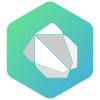

	

	
	
    
    

<blockquote>

<b>Arif Sardar (<a href="https://github.com/NeuroNexul">@NeuroNexul</a>):</b> A highly motivated and accomplished high school student with a strong interest in science and technology. Passionate for <code>software development</code> and have already gained significant experience in <code>web development</code>, <code>Android development</code>, and <code>Arduino projects</code>. In addition to my technical skills, I am also <code>well-versed in electrical work</code> and has a keen interest in <code>scientific research</code>. My dedication and hard work have earned myself <code>recognition by the Government of India</code>, as I have been awarded for my innovation.

I am always on the lookout for new challenges and opportunities to learn and grow, and excited to continue pursuing my interests in the field of technology and science.

</blockquote>

	
	 
	
	
	
	
	
	
	
	
	
	
	
	
	
	
	
	

	

<!-- div align="center">
  	
	 
  	<a href="https://github.com/NeuroNexul" align="center">
		<picture>
  			<source media="(prefers-color-scheme: dark) and (min-height: 600px)" srcset="https://github-readme-stats.vercel.app/api/?username=NeuroNexul&show_icons=true&title_color=ffffff&icon_color=62db9a&text_color=9f9f9f&bg_color=141414&border_color=62db9a&ring_color=62db9a&cache_seconds=7200&include_all_commits=true&count_private=true">
  			<source media="(prefers-color-scheme: light)" srcset="https://github-readme-stats.vercel.app/api/?username=NeuroNexul&show_icons=true&title_color=000000&icon_color=62db9a&text_color=616161&bg_color=f6f8fa&border_color=62db9a&ring_color=62db9a&cache_seconds=7200&include_all_commits=true&count_private=true">
    		
		</picture>
  	</a>
  	<a href="https://github.com/NeuroNexul" align="center">
		<picture>
  			<source media="(prefers-color-scheme: dark)" srcset="http://github-readme-streak-stats.herokuapp.com?user=NeuroNexul&border_radius=5&mode=weekly&background=141414&stroke=62db9a&ring=62db9a&fire=62db9a&sideLabels=FFFFFF&border=62db9a&currStreakNum=FFFFFF&sideNums=FFFFFF&currStreakLabel=FFFFFF&dates=FFFFFF">
  			<source media="(prefers-color-scheme: light)" srcset="http://github-readme-streak-stats.herokuapp.com?user=NeuroNexul&border_radius=5&mode=weekly&background=f6f8fa&stroke=62db9a&ring=62db9a&fire=62db9a&sideLabels=000000&border=62db9a&currStreakNum=000000&sideNums=000000&currStreakLabel=000000&dates=000000">
    		
		</picture>
  	</a>
	<a href="https://github.com/NeuroNexul" align="center">
		<picture>
  			<source media="(prefers-color-scheme: dark)" srcset="https://github-readme-activity-graph.cyclic.app/graph?username=NeuroNexul&bg_color=141414&radius=10&line=62db9a&point=62db9a&color=FFFFFF&area_color=62db9a&area=true&hide_border=true">
  			<source media="(prefers-color-scheme: light)" srcset="https://github-readme-activity-graph.cyclic.app/graph?username=NeuroNexul&bg_color=f6f8fa&radius=10&line=62db9a&point=62db9a&color=000000&area_color=62db9a&area=true&hide_border=true">
  			
		</picture>
  	</a>
</div-->
